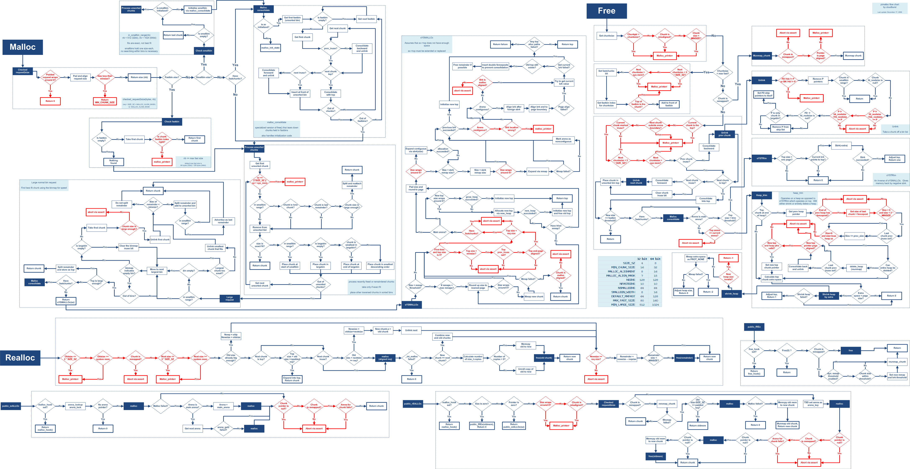

# Linux Memory Manager {#linux-memory-manager}



## Introduction

Memory management is a critical aspect of system programming,
particularly in environments where resource efficiency and performance
are paramount. This project presents a custom **Heap Memory Manager
(HMM)** designed specifically for Linux systems, offering an alternative
to the standard `malloc` and `free` functions with more efficient,
flexible, and robust memory management capabilities.

## Quick Start

### For Users

If you want to use this library in your application:

- [User Guide](docs/pages/user_guide.md) - How to integrate the
  library
- [API Reference](docs/pages/api_reference.md) - Complete API
  documentation
- [GLThreads Guide](docs/pages/glthreads_guide.md) - Understanding
  intrusive linked lists

### For Developers

If you want to understand or contribute to the implementation:

- [Architecture Overview](docs/pages/architecture.md) - System
  design and internals
- [Developer Guide](docs/pages/developer_guide.md) - Build, test,
  and contribute
- [Doxygen Guide](docs/pages/doxygen_guide.md) - Documentation
  standards

## Why Custom Memory Management?

In typical Linux applications, memory management is handled by the
system's allocator, which uses functions like `malloc`, `calloc`, and
`free`. While these standard functions are sufficient for many
applications, they may not provide the level of control, efficiency, or
customization required for certain high-performance or specialized
applications.

This project addresses these limitations by offering:

- **Improved Performance** - Custom memory allocation algorithms can
  reduce fragmentation and enhance performance
- **Thread Safety** - The GLib Thread (GLThread) module provides a
  thread-safe linked list implementation, essential for concurrent
  applications
- **Memory Usage Optimization** - The HMM system is designed to make
  better use of available memory, reducing wastage and improving
  overall application efficiency
- **Fine-grained Control** - Developers have precise control over
  memory allocation strategies

## Key Features

- **Custom Heap Memory Manager** - A robust memory management system
  that replaces standard dynamic memory allocation
- **Thread-Safe Operations** - Generic, thread-safe linked list
  implementation using GLThread
- **Comprehensive Testing** - Extensive test suite ensuring
  reliability and robustness
- **Flexible Integration** - Available as both static (`.a`) and
  shared (`.so`) libraries
- **Zero External Dependencies** - Self-contained implementation for
  maximum portability
- **Production Ready** - Battle-tested and optimized for real-world
  applications

## Getting Started

### Prerequisites

- GCC compiler (version 7.0 or higher)
- GNU Make
- Linux operating system (tested on Ubuntu 20.04+)
- Doxygen (optional, for documentation generation)

### Build Instructions

**Build everything:**

::: {#cb1 .sourceCode}

```{.sourceCode .sh}
make all
```

:::

**Build static library only:**

::: {#cb2 .sourceCode}

```{.sourceCode .sh}
make static
```

:::

**Build shared library only:**

::: {#cb3 .sourceCode}

```{.sourceCode .sh}
make shared
```

:::

**Run tests:**

::: {#cb4 .sourceCode}

```{.sourceCode .sh}
./bin/hmm
```

:::

**Generate documentation:**

::: {#cb5 .sourceCode}

```{.sourceCode .sh}
make doc
```

:::

## Project Structure

```text
📁 Linux Memory Manager
├── 📂 src/ — Core implementation
│   ├── 📄 memory_manager.c — Memory manager core
│   ├── 📄 glthread.c — Thread-safe linked lists
│   ├── 📄 datatype_size_lookup.c — Type size utilities
│   └── 📄 parse_datatype.c — Type parsing utilities
├── 📂 include/ — Public headers
│   ├── 📄 memory_manager_api.h — Public API
│   ├── 📄 memory_manager.h — Internal structures
│   ├── 📄 glthread.h — GLThread API
│   └── 📄 colors.h — Terminal colors
├── 📂 docs/ — Documentation
│   ├── 📂 pages/ — Additional pages
│   └── 📂 assets/ — Images and resources
├── 📂 bin/ — Compiled executables
├── 📂 lib/ — Generated libraries
├── ⚙️ Makefile — Build system
├── 📄 README.md — This file
└── 📄 LICENSE — License information
```

## Documentation Navigation

This documentation is organized into the following sections:

**For Users:**

- User Guide
- API Reference
- Integration Guide

**For Developers:**

- Architecture Overview
- Developer Guide
- Testing Guide

**Additional Resources:**

- GLThread Data Structures
- Building the Project
- Contributing Guidelines

## License

This project is licensed under the MIT License. See the LICENSE file for
details.

## Acknowledgments

This project is part of the Linux System Programming course offered by
STMicroelectronics Egypt. Special thanks to the course instructors and
contributors for their valuable input and guidance.

## Contact & Contributing

We welcome contributions! Please see the contributing guidelines for
details on how to contribute.

- **Issues:** Report bugs or request features on [GitHub
  Issues](https://github.com/orcalinux/linux-memory-manager/issues)
- **Pull Requests:** Submit improvements via pull requests
- **Documentation:** Help improve documentation
